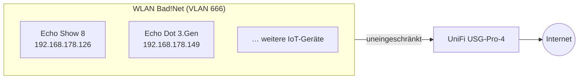
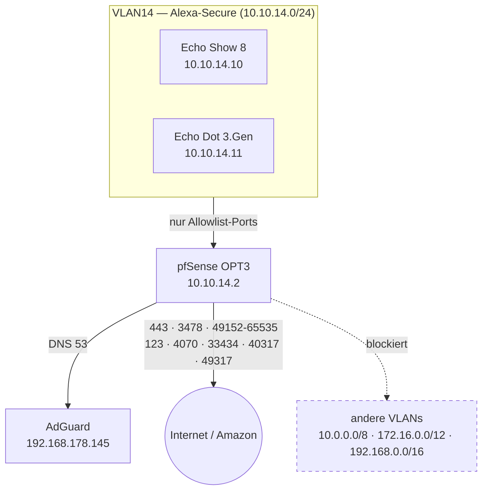
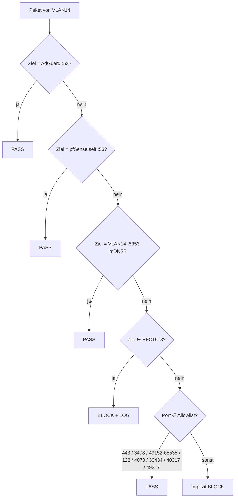
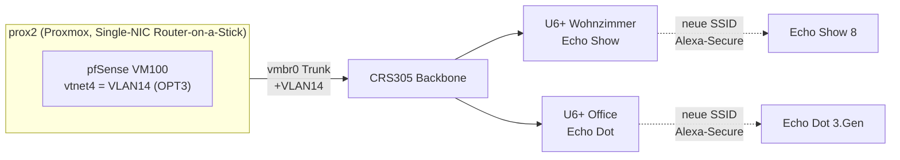

# Architektur

## Vorher: Alexa im geteilten IoT-WLAN

Beide Alexa-Geräte hingen im "Bad!Net"-WLAN (VLAN 666) — dem alten, unsegmentierten IoT-Netz, gemeinsam mit anderen, noch nicht migrierten IoT-Geräten. Keine geräteklassen-spezifischen Firewall-Regeln, volles Internet ohne Einschränkung.

## Nachher: dediziertes VLAN14 mit Default-Deny

Ein neues, ausschließlich für Alexa reserviertes VLAN — eigene Firewall-Zone auf pfSense, minimale Ports-Allowlist, kein Zugriff auf andere interne Netze.

## Firewall-Regelreihenfolge (first-match-wins)

Die Reihenfolge ist entscheidend: spezifische Allows zuerst, dann der Block für private Netze, dann die generischen Internet-Allows. So kann AdGuard (eine private IP) erreicht werden, während Zugriff auf alle anderen internen Netze blockiert bleibt.

## Port-Allowlist

| Ziel/Zweck | Protokoll | Port |
|---|---|---|
| Amazon-Endpunkte (Signaling, App) | TCP | 443 |
| STUN/TURN (Anrufe, Intercom) | TCP+UDP | 3478 |
| SRTP-Audio | UDP | 49152–65535 |
| NTP | UDP | 123 |
| mDNS (nur lokal, VLAN14-intern) | UDP | 5353 |
| Amazon Custom-Dienste | TCP+UDP | 4070, 33434, 40317, 49317 |

Quelle: Amazon Developer Docs "Alexa Smart Properties — Networking Best Practices" (Enterprise-Kontext, community-bestätigt für Consumer-Echo, siehe [00-ausgangslage.md](00-ausgangslage.md)).

## Physische Topologie

