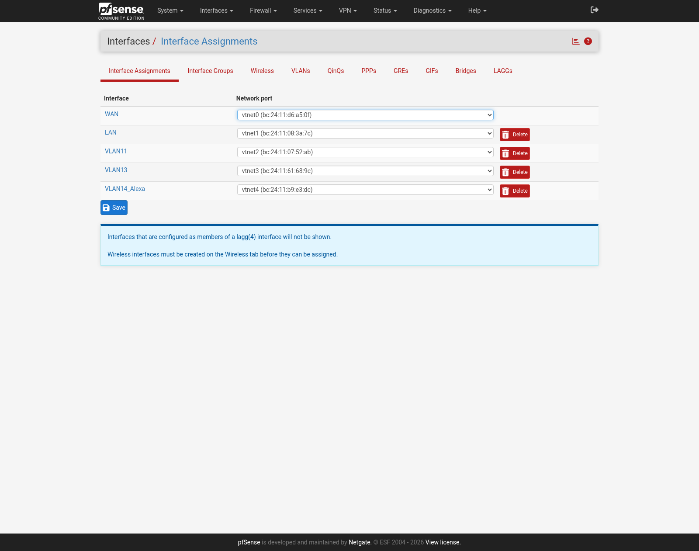
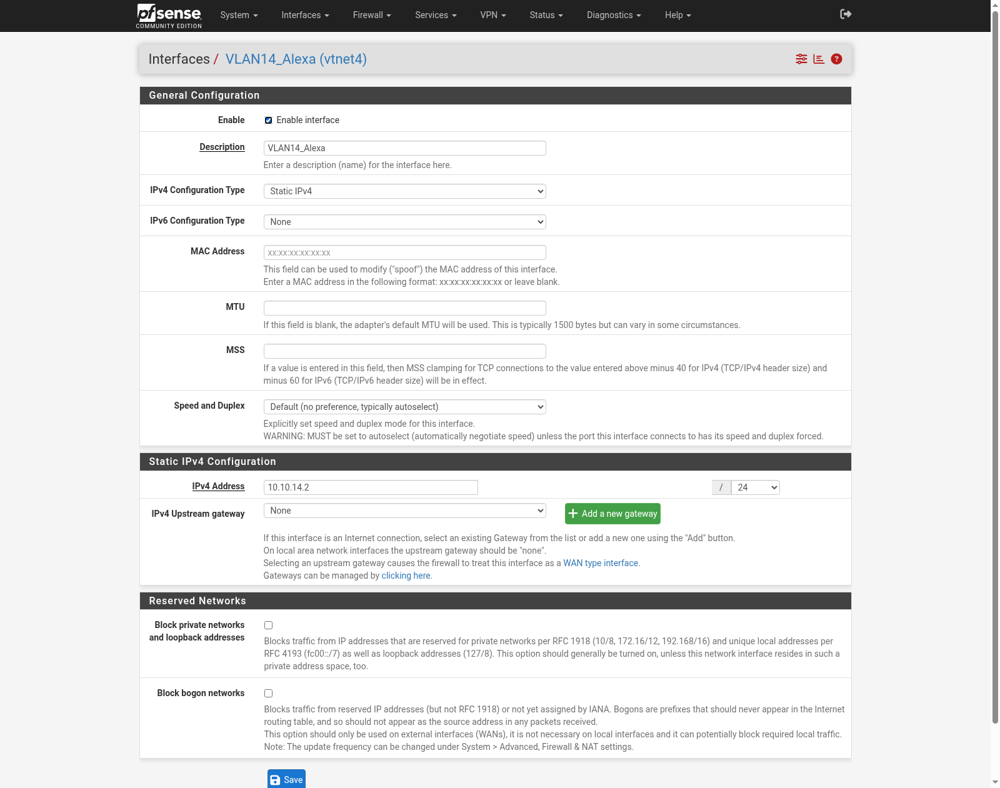
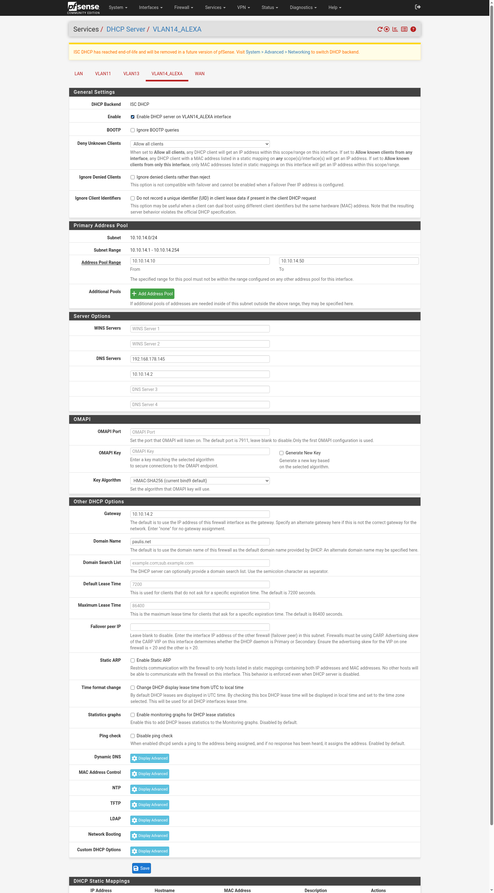
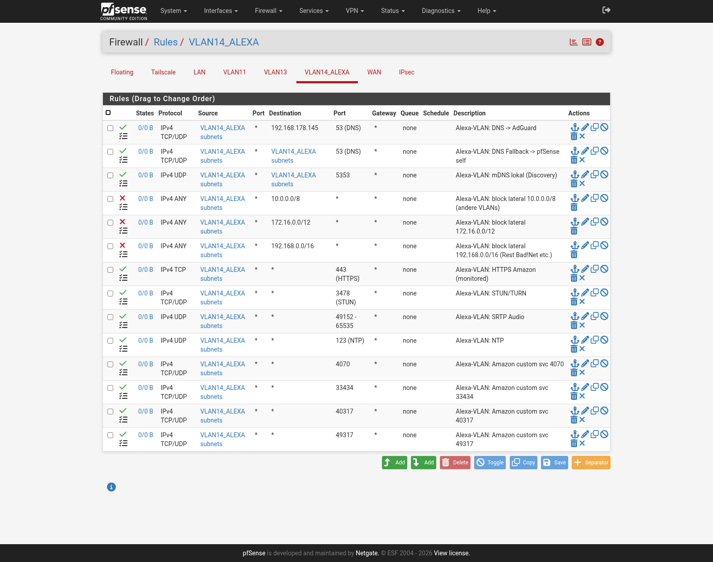

# pfSense-Setup — Schritt für Schritt

Umgesetzt auf pfSense CE 2.7.2 (VM100, prox2, Proxmox `192.168.178.65`). Alle Schritte funktionieren identisch über die Web-GUI — hier als Klickanleitung dokumentiert.

> **Vorher immer:** Proxmox-Snapshot der VM, bevor du Interfaces oder Firewall-Regeln änderst. `pfSense CE` läuft hier auf UFS ohne Boot-Environment-Rollback — der Proxmox-Snapshot IST der Rollback-Mechanismus.
> ```
> qm snapshot 100 pre-alexa-vlan --description "vor VLAN14"
> # Revert falls nötig:
> qm rollback 100 pre-alexa-vlan
> ```

## 1. Neues Netzwerk-Interface (VLAN14)

Da pfSense hier als Single-NIC-Router-on-a-Stick läuft (ein physischer Netzwerkport, VLANs werden am Proxmox-Bridge `vmbr0` getaggt), braucht ein neues VLAN ein neues virtuelles Netzwerk-Interface an der VM:

```
qm set 100 -net4 virtio,bridge=vmbr0,tag=14
qm reboot 100
```

**Wichtig:** Ein per Proxmox hinzugefügtes virtio-NIC zeigt sich in pfSense zwar sofort als "active", sendet aber keine Pakete (TX tot), bis die VM neu gestartet wurde. Der Neustart ist bei einer Single-Egress-Firewall ein kurzer Ausfall für das ganze Haus (~1–2 Min.) — an der Fritte einplanen.

## 2. Interface zuweisen

*Interfaces → Assignments* → neuer Eintrag `vtnet4` → als `OPT3` zuweisen, umbenennen zu `VLAN14_Alexa`.



## 3. Interface konfigurieren

*Interfaces → VLAN14_Alexa*: Enable, Static IPv4, `10.10.14.2/24`, kein Upstream-Gateway (LAN-Typ, kein WAN).



## 4. DHCP-Server aktivieren

*Services → DHCP Server → VLAN14_Alexa*: Pool `10.10.14.10`–`10.10.14.50`, DNS-Server **AdGuard zuerst** (`192.168.178.145`), pfSense-Resolver als Fallback (`10.10.14.2`), Gateway `10.10.14.2`. Statische Reservierungen für die beiden bekannten Alexa-MACs, damit sich später gezielt pro Gerät firewallen lässt.



## 5. Firewall-Regeln

*Firewall → Rules → VLAN14_Alexa* — Reihenfolge ist entscheidend (first-match-wins), siehe [Architektur](01-architektur.md#firewall-regelreihenfolge-first-match-wins):

1. DNS → AdGuard (`192.168.178.145:53`, TCP+UDP)
2. DNS-Fallback → pfSense selbst (`:53`)
3. mDNS lokal (`:5353`, nur VLAN14-intern)
4. **Block** → `10.0.0.0/8` (loggt jeden Versuch, andere VLANs zu erreichen)
5. **Block** → `172.16.0.0/12`
6. **Block** → `192.168.0.0/16` (blockt auch den Rest von Bad!Net, außer der explizit erlaubten AdGuard-IP aus Regel 1)
7. HTTPS `:443` → Internet (geloggt, für Volumen-Monitoring)
8. HTTP `:80` → Internet (TCP, geloggt) — **nachträglich ergänzt** (21.07.), siehe [Bekannte Probleme](#bekannte-probleme-nach-erster-migration)
9. STUN/TURN `:3478` (TCP+UDP)
10. SRTP-Audio `udp/49152-65535`
11. NTP `udp/123`
12–15. Amazon Custom-Ports `4070`, `33434`, `40317`, `49317` (TCP+UDP)



Alles außerhalb dieser Liste fällt auf pfSenses impliziten Deny-All am Ende der Kette — kein extra Regel nötig.

## Bekannte Probleme (nach erster Migration)

Nach der ersten realen Geräte-Migration (Echo Show, 21.07.) zwei Live-Erkenntnisse:

- **HTTP `:80` fehlte in der ursprünglichen Regel-Liste.** Symptom: Gerät verbindet sich, spielt kurz, hört dann plötzlich auf zu reagieren/spielen. Ursache: Amazon-Geräte machen offenbar einen HTTP-Connectivity-Check zu mehreren AWS-Hosts, bevor sie sich als "voll verbunden" betrachten — ohne Port 80 bleibt das Gerät in einem inkonsistenten Zustand. Fix: Regel 8 oben ergänzt (analog zu HTTPS, nur TCP).
- **Multi-Room/Gruppen-Funktionen zwischen migrierten und nicht-migrierten Geräten funktionieren nicht mehr** (beobachtet: wiederholte geblockte Verbindungsversuche zum noch nicht migrierten zweiten Echo-Gerät auf Port `55443`). Das ist **erwartetes Verhalten** der VLAN-Isolation, kein Bug — sobald alle Alexa-Geräte in VLAN14 sind, sollte das wieder funktionieren (beide dann intern erreichbar, nicht mehr durch die Lateral-Movement-Blockregeln getrennt).

## Verifikation

```
pfctl -sr | grep vtnet4
```
zeigt die kompilierte Regelkette in der tatsächlich angewendeten Reihenfolge — guter Weg, um vor dem Live-Schalten eines Geräts zu bestätigen, dass nichts fehlt oder in falscher Reihenfolge steht.
