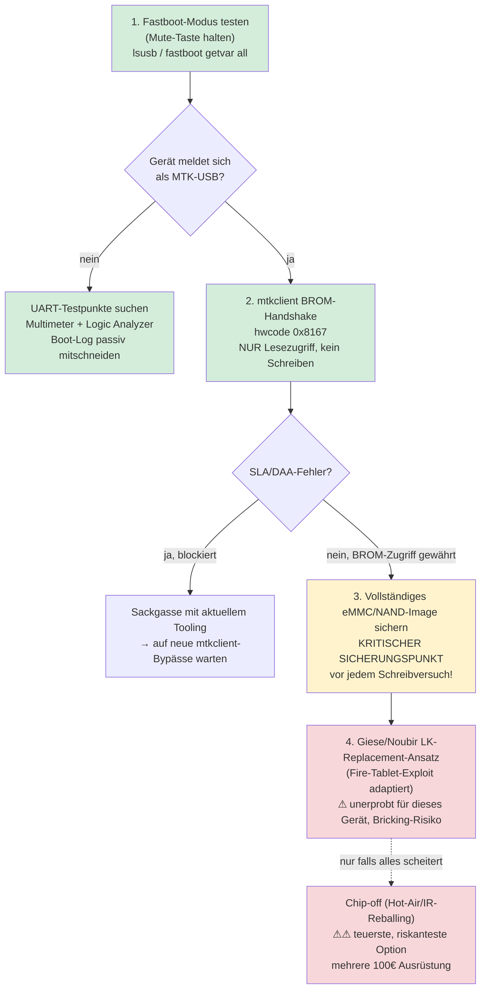

# Root-Zugriff-Recherche: Echo Dot 3. Gen (MT8516, "Donut")

Ziel: verlässlicher Code-Execution/Root-Zugriff auf einem selbst gekauften Echo Dot 3. Gen (Modell D9N29T, FCC ID 2AOAG-3668, SoC MediaTek MT8516BAAA) als Hobby-Reverse-Engineering-Projekt, inkl. Folgerecherche zur eigenen CA/TLS-Interception (siehe [eigener Abschnitt](#folgerecherche-eigene-ca--tls-interception) unten).

**Ehrliches Fazit vorweg:** Es gibt aktuell **keine fertige, dokumentierte Root-Methode** für dieses Gerät. Der unten skizzierte Pfad ist der plausibelste recherchierte Ausgangspunkt für eigene Forschung — kein garantiertes Rezept. Jede Kernbehauptung wurde mit mehreren unabhängigen Quellen gegengeprüft (siehe [Quellen](#quellen)); Behauptungen, die die Prüfung nicht überstanden, sind explizit unter [Widerlegt](#widerlegt-nicht-glauben) aufgeführt.

## Warum Echo Dot 2. Gen nicht als Vorlage taugt

Der öffentlich dokumentierte **Kamakiri**-Exploit ([github.com/amonet-kamakiri/kamakiri](https://github.com/amonet-kamakiri/kamakiri)) ist im Quellcode **hart auf genau ein Gerät verdrahtet**: Echo Dot 2. Gen, Codename `mantis`, MT8163, `device_type_id AKPGW064GI9HE`. Der Code prüft diese ID explizit und bricht bei jedem anderen Gerät sofort mit `exit(1)` ab — keine MT8516-Logik, keine Geräte-Tabelle, kein Fallback. Das Repo hat kein README und keine Issues/Tags zu Echo/Alexa/MT8516/Donut. **Confidence: hoch**, 3 unabhängige Quellen (Quellcode selbst, danieldb.uk, Hackaday).

## Der vielversprechendste Ansatz: mtkclient

`mtkclient` ([bkerler/mtkclient](https://github.com/bkerler/mtkclient)) ist ein generisches MediaTek-BROM/Preloader-Tool (nicht Amazon-spezifisch) mit einem **hartkodierten Chip-Config-Eintrag**, der MT8516 zusammen mit MT8167 und MT8362 gruppiert (`hwcode 0x8167`, gemeinsamer DA-Loader `mt8167_payload.bin`). Das ist technische Unterstützung auf BootROM-Ebene für die Chip-*Familie* — nirgendwo in der Doku mit Amazon/Echo in Verbindung gebracht. **Confidence: hoch** (Quellcode selbst, 2 Repo-Forks).

Der gleiche Kamakiri-Mechanismus über mtkclient wurde erfolgreich auf einem **anderen** MT8516-Consumer-Gerät demonstriert (Xiaomi Mi Smart Clock, gleiche Chip-Familie) — starkes Indiz für generelle Machbarkeit auf MT8516-Hardware, aber **kein Beweis für den Echo Dot 3 selbst**. **Confidence: medium** (XDA-Quelle war nur indirekt über Sekundärquellen bestätigbar, Primärquelle lieferte 403 Forbidden).

## Die entscheidende offene Frage: SLA/DAA-Schutzstatus

Ob der MT8516 im Echo Dot 3 den MediaTek-Auth-Schutz (SLA/DAA) aktiviert hat, ist **nicht verlässlich geklärt** — beide dazu passenden Behauptungen aus der Vorrecherche wurden im Verifikationsprozess verworfen. Das ist der entscheidende unbekannte Faktor für die Erfolgswahrscheinlichkeit: Ist SLA/DAA **deaktiviert**, kann mtkclient vermutlich direkt zugreifen. Ist es **aktiviert**, braucht es zusätzlich einen Auth-Bypass, der für MT8516 nicht dokumentiert ist.

**Das lässt sich nur empirisch klären** — Schritt 2 im Plan unten ist genau dafür da.

## Was zu Secure Boot & Speicher bekannt ist

- **Secure Boot ist aktiv und vollständig implementiert** (Confidence: hoch, akademisches WiSec-2021-Paper + briandorey.com): BootROM verifiziert den Preloader via eFuse-RSA-Hash, ARM Trusted Firmware läuft in TrustZone EL3, Little Kernel wird verifiziert geladen. Anti-Rollback-Schutz über RPMB — aber **nicht alle Geräte haben RPMB provisioniert**, d. h. der Rollback-Schutz kann bei manchen Einheiten faktisch leer/wirkungslos sein (nur am eigenen Gerät prüfbar).
- **Speicher-Architektur ist widersprüchlich dokumentiert**: iFixit-Teardown findet zwei getrennte Chips (Micron NAND Flash + Samsung DDR3 RAM), die echohacking-Wiki nennt einen kombinierten eMMC+DRAM-Chip. Vermutlich unterschiedliche Hardware-Revisionen/Fertigungschargen. **Vor jedem Chip-off-Versuch: eigenes Gerät öffnen und die tatsächlich verbauten Chips fotografisch verifizieren.**
- **UART-Testpunkt existiert physisch** und liefert das Boot-Log ohne vorherigen Exploit (Confidence: hoch) — **aber exakte Pin-Belegung und Baudrate sind nicht verlässlich verifiziert**, eine dazu passende Detail-Behauptung wurde verworfen. Vor Anschluss eines UART-Adapters: Multimeter-Continuity-Check + Logic-Analyzer-Scan des eigenen Geräts.
- **Fastboot-/BootROM-Modus ist nicht-invasiv erreichbar**: Mute-Taste beim Einschalten halten → LED grün → Gerät meldet sich als MediaTek-USB-Gerät (Confidence: medium, eine Quelle: briandorey.com).

## Empfohlener Plan — von reversibel zu riskant

| Schritt | Reversibel? | Werkzeug | Kosten |
|---|---|---|---|
| 1. Fastboot-Test + UART-Mitschnitt | ✅ vollständig, keine Änderung am Gerät | USB-TTL-UART-Adapter | ~5–10 € |
| 2. mtkclient BROM-Handshake (nur lesen) | ✅ vollständig, Gerät einfach neu starten | mtkclient (Software, kostenlos) | 0 € |
| 3. eMMC/NAND-Image-Backup | ✅ (reiner Lesevorgang) | mtkclient | 0 € |
| 4. LK-Replacement-Versuch | ❌ **nicht reversibel ohne Backup aus Schritt 3** | mtkclient, ggf. Löten falls Testpunkte nicht klemmbar | variabel |
| 5. Chip-off (letztes Mittel) | ❌ destruktiv | Heißluftstation, Reballing-Kit | mehrere 100 € |

**Wichtigste Regel:** Schritt 3 (Backup) ist die Grenze zwischen "jederzeit rückgängig machbar" und "echtes Risiko". Nichts vor Schritt 3 schreiben.

## Folgerecherche: eigene CA / TLS-Interception

Aufbauend auf obiger Root-Recherche: Angenommen, Schritt 3 (eMMC/NAND-Backup) gelingt und liefert Schreibzugriff — wie käme man dann tatsächlich an entschlüsselten TLS-Traffic? Auch hier gilt: **kein Rezept, sondern der ehrlichste verfügbare Zwischenstand.**

**Wichtige Korrektur gegenüber der ursprünglichen Annahme:** Der Echo Dot läuft **nicht** auf einem minimalen Custom-Linux, sondern auf **Fire OS = einem angepassten Android** (Generation 3 konkret: **Android 7.1.2 „Nougat"**). **Confidence: hoch**, 3/3-Votum, zwei unabhängige Primärquellen (Giese & Noubir, WiSec 2021, sowohl als Preprint als auch als ACM-DL-Version separat verifiziert). Das ist strukturell eine gute Nachricht: Der SoC ist zudem ein **64-bit ARM64/AArch64**-Vierkerner (nicht 32-bit, wie zunächst vermutet) — Standard-Android-Sicherheitstooling (Frida, SSL-Pinning-Bypass-Techniken) ist damit architektonisch grundsätzlich kompatibel, *sofern* Root erreicht wird und Frida sich auf dieser spezifischen Fire-OS-Variante tatsächlich zum Laufen bringen lässt (unbestätigt).

### Der einzige bestätigte volle Erfolg — und warum er nicht direkt übertragbar ist

Ein akademisches Forscherteam (Janak, Tseng, Isaacs, Schulzrinne, Columbia University, IEEE GLOBECOM 2021) hat Root-Zugriff auf einen Echo erreicht und dessen TLS-Traffic zur Amazon-Cloud erfolgreich entschlüsselt. **Confidence: hoch, 3/3**, [arxiv.org/pdf/2105.13500](https://arxiv.org/pdf/2105.13500). **Entscheidender Haken:** Das war ein **Echo der 1. Generation** (2016, deutlich ältere/schwächere Hardware, UART-Zugriff+SD-Karten-Boot) — **nicht** der Dot 3. Gen (MT8516). Der genaue technische Mechanismus, wie sie TLS-Vertrauen ausgehebelt haben, ließ sich in der Verifikation nicht mehr eindeutig bestätigen (die entsprechende Detail-Behauptung wurde verworfen, 0-3) — die Methode selbst bleibt also im Detail unklar, nur das Endergebnis (Entschlüsselung gelungen) ist gut belegt.

### Hinweise auf reale Hürden bei näher verwandten Geräten

Diese Punkte konnten wegen eines technischen Rate-Limits beim Recherche-Tool nicht mehr gegenverifiziert werden (nur 1 statt 3 Stimmen pro Behauptung) — Quellen sind aber inhaltlich plausibel und stammen aus brauchbaren Primär-/Blog-Quellen, deshalb hier als **unverifiziert, aber relevant** aufgeführt:

- Ein Uni-Capstone-Projekt versuchte einen SSLsplit-MITM-Angriff gegen den **Echo Dot 2. Gen** (MT8163 — engster verwandter Chip zum MT8516) — **das Zertifikat wurde vom Gerät abgelehnt**, die Verbindung schlug fehl. Deutet auf aktive Zertifikatsprüfung/Pinning auf dieser Geräte-Familie hin. ([github.com/jhautry/echo-dot](https://github.com/jhautry/echo-dot))
- Ein anderes Forschungsteam hatte **vollen eMMC-Dateisystem-Zugriff** auf ein Fire-OS-Echo-Gerät, konnte aber **keine eigene CA installieren oder einen Proxy setzen** — sie gaben die On-Device-Interception explizit auf und wichen auf Companion-App-/Cloud-API-Analyse aus. ([arxiv.org/pdf/2408.15768](https://arxiv.org/pdf/2408.15768))
- Der bestehende Kamakiri-Root-Guide für den Dot 2. Gen (der einzige öffentlich dokumentierte volle Root-Erfolg in der Produktfamilie) enthält **keinerlei** Hinweise zu TLS-Interception, CA-Installation oder Pinning — Root wurde erreicht, aber niemand hat den nächsten Schritt veröffentlicht. ([danieldb.uk/posts/alexa-2](https://danieldb.uk/posts/alexa-2/))
- Der LineageOS-Jailbreak-Weg für Echo Show 5/8 (derekseaman.com) **ersetzt Fire OS komplett** durch ein normales Android — das bedeutet, der ursprüngliche Alexa/AVS-Client (dessen Traffic man eigentlich abhören wollte) ist danach schlicht **weg**. Root über diesen Weg löst also nicht das eigentliche Beobachtungsziel.

### Realistische Einordnung

TLS-Interception ist **nicht** "CA installieren, fertig" — selbst der einzige bestätigte volle Erfolg war an viel älterer, schwächerer Hardware. Die (unverifizierten, aber plausiblen) Datenpunkte oben deuten übereinstimmend auf **aktives Certificate Pinning oder zumindest harte Trust-Store-Validierung** in der Echo-Dot-Produktfamilie hin, die über eine reine System-CA-Store-Änderung hinausgeht. Realistisch bedeutet das: Selbst nach erfolgreichem Root (schon für sich unsicher, siehe oben) kommt vermutlich ein **zweiter, eigenständig schwieriger Schritt** dazu — Pinning-Bypass via Frida/Runtime-Hooking (Android-Tooling technisch anwendbar, da Fire OS = Android) oder Reverse Engineering des statisch gelinkten AVS-Clients (Ghidra). Das ist eher **"eine ganze Stufe schwerer"** als "moderat schwerer" on top vom bereits unsicheren Root-Schritt — kein Wochenend-Projekt, sondern ein eigenständiges Forschungsvorhaben.

## Widerlegt — nicht glauben

Diese Annahmen aus der Ausgangsrecherche wurden explizit **verworfen**:

- Ein alternativer Boot-Modus über Dot-Taste + Minus-Taste gleichzeitig — falsch, nicht dokumentiert bestätigt.
- Ein spezifischer UART-TX-Pin mit 115200→921600-Baud-Wechsel auf dem CPU — falsch, Detail nicht verlässlich verifizierbar.
- Der kombinierte eMMC+DRAM-Chip (widerspricht dem iFixit-Teardown, der getrennte Chips findet) — siehe Speicher-Architektur oben.
- Dass für MT8516 mit aktiviertem SLA/DAA aktuell **kein** Bypass existiert — diese Aussage wurde verworfen (d. h. sie ist **nicht bestätigt als wahr**, aber auch nicht als falsch — schlicht ungeklärt).

## Was diese Recherche nicht abdecken konnte

- Discord/Telegram-Communities sowie russische/chinesische Hacking-Foren und CCC-Talk-Recordings waren mit den verfügbaren Suchwerkzeugen nicht durchsuchbar — dort könnten unveröffentlichte Fortschritte existieren.
- Ob die von Giese/Noubir angedeutete Downgrade-/LK-Replacement-Route praktisch umsetzbar ist (inkl. ob noch eine alte, signierte, aber verwundbare FireOS-Version für den Donut verfügbar ist), bleibt offen.
- Zwei Recherche-Teilschritte sind ohne verwertbares Ergebnis fehlgeschlagen: ein Claim wurde von Anthropics automatischem Cybersecurity-Sicherheitsfilter blockiert (rein prozessbedingt, kein inhaltlicher Befund — dieses Thema ist legitime Forschung an eigener Hardware), ein anderer erreichte das technische Retry-Limit. Beide betreffen Detail-Verifikationen, nicht die Kernaussagen dieses Dokuments.

## Quellen

| Quelle | Qualität |
|---|---|
| [github.com/amonet-kamakiri/kamakiri](https://github.com/amonet-kamakiri/kamakiri) | primär (Quellcode) |
| [github.com/bkerler/mtkclient](https://github.com/bkerler/mtkclient) | primär (Quellcode) |
| [github.com/R0rt1z2/mtkclient](https://github.com/R0rt1z2/mtkclient) | primär (Quellcode, Fork) |
| Giese & Noubir, "Amazon Echo Dot or the Reverberating Secrets of IoT Devices", ACM WiSec 2021 ([PDF](https://dontvacuum.me/papers/ACMWisec-2021/Amazon_Echo_Forensics_for_WISEC_final.pdf), [ACM DL](https://dl.acm.org/doi/abs/10.1145/3448300.3467820)) | primär, peer-reviewed |
| [ifixit.com — Echo Dot 3rd Gen Teardown](https://www.ifixit.com/Teardown/Amazon+Echo+Dot+3rd+Generation+Teardown/138560) | primär |
| [briandorey.com — Echo Dot 3rd Gen Digging Deeper](https://www.briandorey.com/post/echo-dot-3rd-gen-digging-deeper) | Blog, technisch fundiert |
| [github.com/echohacking/wiki/wiki/Echo-Dot-v3](https://github.com/echohacking/wiki/wiki/Echo-Dot-v3) | Community-Wiki (aktuell ohne Exploit-Anleitung) |
| [danieldb.uk/posts/alexa-2](https://danieldb.uk/posts/alexa-2/) | Blog (bezieht sich auf Gen 2, als Kontrastfolie relevant) |
| [hackaday.com — Root on an Amazon Echo Dot](https://hackaday.com/2023/07/22/root-on-an-amazon-echo-dot/) | Blog (Gen 2) |
| Janak, Tseng, Isaacs, Schulzrinne — "An Analysis of Amazon Echo's Network Behavior", IEEE GLOBECOM 2021 ([PDF](https://arxiv.org/pdf/2105.13500)) | primär, peer-reviewed |
| [github.com/jhautry/echo-dot](https://github.com/jhautry/echo-dot) | Uni-Capstone-Projekt (unverifiziert, 1 Quelle) |
| [arxiv.org/pdf/2408.15768](https://arxiv.org/pdf/2408.15768) | Preprint (unverifiziert, 1 Quelle) |
| [derekseaman.com — Home Assistant Hacking Echo Show 5/8](https://www.derekseaman.com/2025/11/home-assistant-hacking-your-echo-show-5-and-8.html) | Blog (unverifiziert, 1 Quelle) |
